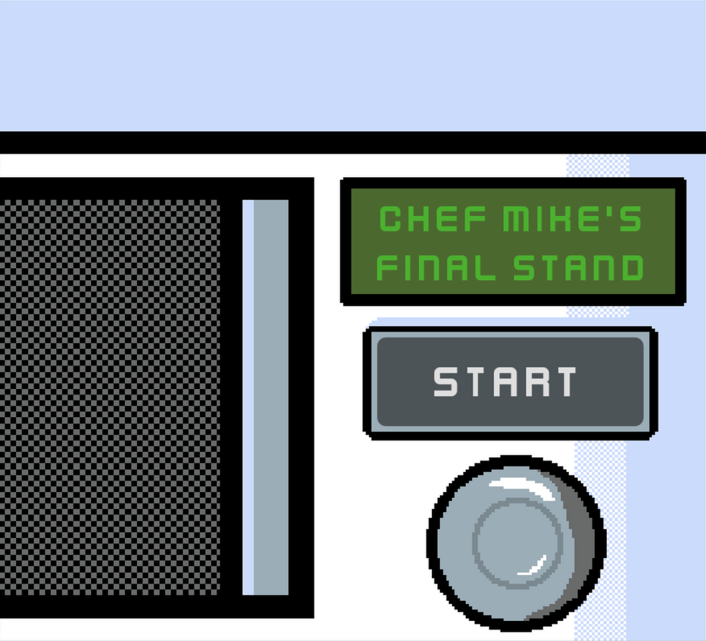
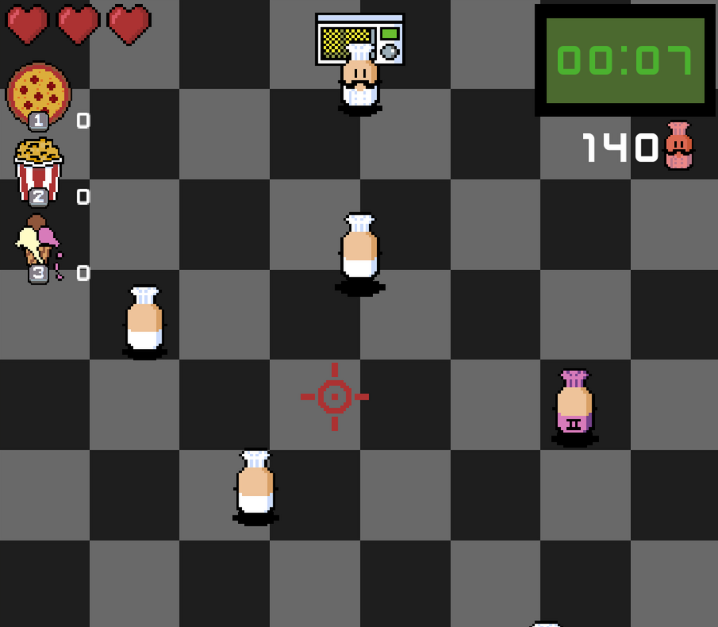
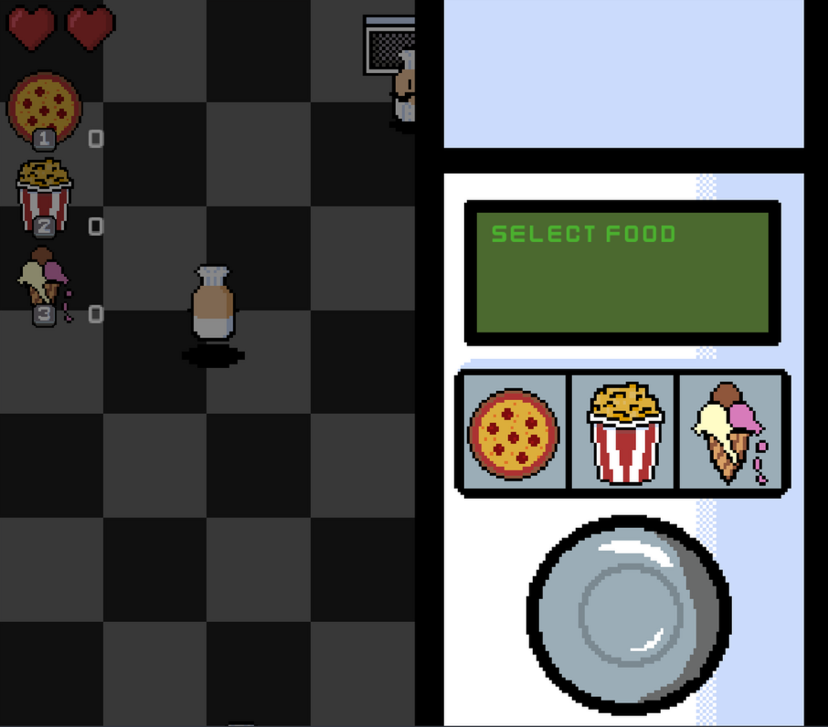
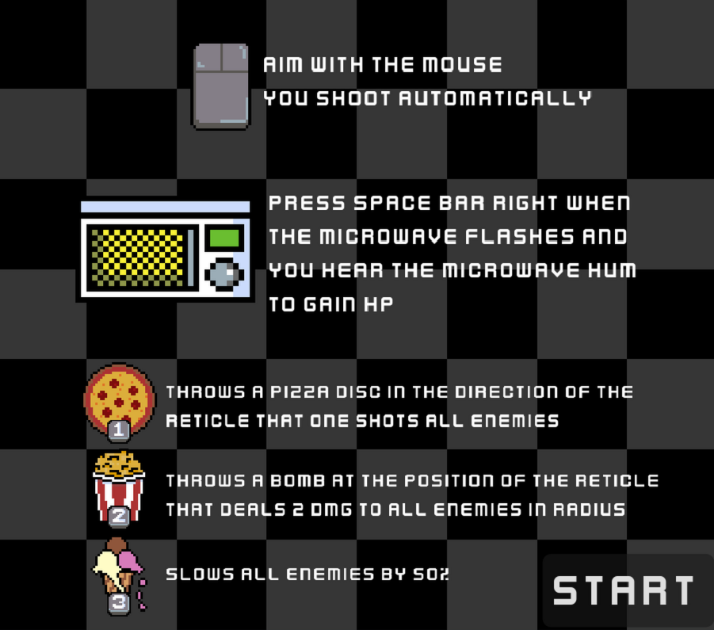

# Chef Mike's Final Stand

This is a top-down "microwave-like" created for the GMTK Game Jam 2026 (theme: "Count Down") using the Godot Engine: https://1nder-games.itch.io/chef-mikes-final-stand

## About

Play as Chef Mike, the world's #1 chef, known around the globe for cooking delicious 5-star meals with only a microwave. Defend against the onslaught of angry chefs who want to destroy Chef Mike and his magical microwave!

The game is built around the relatable experience of trying to open the microwave right when it hits 0, but before it beeps. Cook power-ups in the microwave, then grab them at the perfect moment for a bonus heal. Clear the kitchen to win, and each victory sends in an even bigger crowd.

Cook a power-up, then snatch it out right before the ding to earn a heal — but you only get one shot, so time it with the flash and the rising hum.

## Controls

| Action                | Input   |
| --------------------- | ------- |
| Aim                   | Mouse   |
| Pizza Disc            | `1`     |
| Popcorn Bomb          | `2`     |
| Icecream Freeze       | `3`     |
| Microwave Skill Check | `Space` |

## Credits

### Programming & Art

1nder

### Font

[Kenney Assets](https://kenney.nl/)

### Explosion Effect

[ansimuz](https://ansimuz.itch.io/explosion-animations-pack)

### Sound Effects

[Coffee 'Valen' Bat](https://coffeevalenbat.itch.io/sweet-sounds-sfx-pack)

[chennes](https://freesound.org/people/chennes/sounds/376807/) — Microwave Ding

[passAirmangrace](https://freesound.org/people/passAirmangrace/sounds/340920/) — Microwave Hum

[supersnd](https://freesound.org/people/supersnd/sounds/400686/) — Microwave Close

### Music

[Tallbeard Studios](https://tallbeard.itch.io/three-red-hearts-prepare-to-dev)
